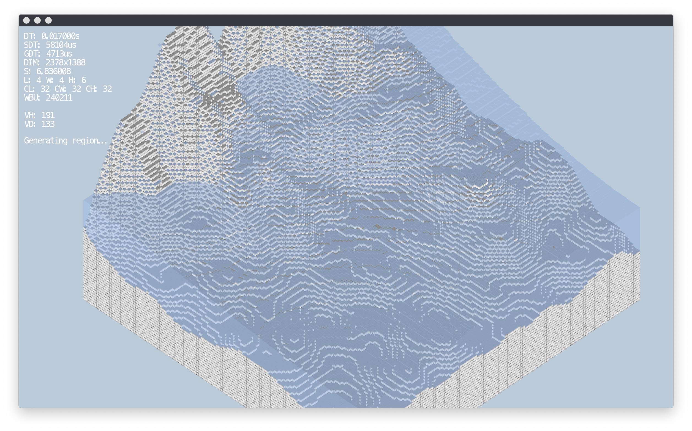

# Isometric Game

## About:
This project is currently a work in process. It is a 2D Isometric game, where you control a simulated 3D tile-based world.



## Supported Platforms:
- OSX / MacOS
- Windows


## How to Build:
This project includes a **bash build script** (for OSX) and a **bat build script** (for Win32) that when run will build the project.
The Compiler user by the bash build script is *Clang*. The compiler used by the bat build script is *MSVC*. *NOTE:* For Win32, Visual Studio is required as *vcvarsall.bat* with a x64 target needs to be run for MSVC to work.

- ```./build_osx.sh```, will generate an OSX exectuable using *Clang*.
- ```build_win32.bat```, will generate an Windows exectuable using *MSVC*.

Build products can be found inside the **'build/'** directory.


## Required Libraries:
### OSX:
This project uses both built-in Apple frameworks in addition to some custom libraries:
```
Apple:
 - Cocoa framework
 - Quartz framework
 - OpenGL framework
Custom:
 - Freetype (built without 'zlib', 'png' and 'bzip2')
```

### Windows:
This project uses both built-in Windows libraries in addition to some custom libraries:
```
Windows:
 - opengl32.lib
 - glu32.lib
 - gdi32.lib
 - user32.lib
 - kernel32.lib (may not be needed)
 - shell32.lib (may not be needed)
Custom:
 - Freetype (requires 'msvcrt.lib' and 'msvcmrt.lib')
 - GLEW
```

## Tools:
#### Sublime Text:
There is a Sublime Text 3 project included inside the **'other/'** folder for convenience. It can be used to build directly from inside the sublime editor. *NOTE:* The building from inside sublime has only been setup for mac.

#### Xcode (OSX):
An Xcode project has been setup inside the **'other/'** folder to allow for debugging the generated exectutable. The **'-g'** compiler option is required to be passed to *clang* for breakpoints and other propper debugging to work.

- **NOTE:** By default the build script is referenced relative to the project directory, however for the scheme you will need to point it to the location of the generated exectuable as this can not be relative.

#### Visual Studio (Windows):
*This has not been setup.*
